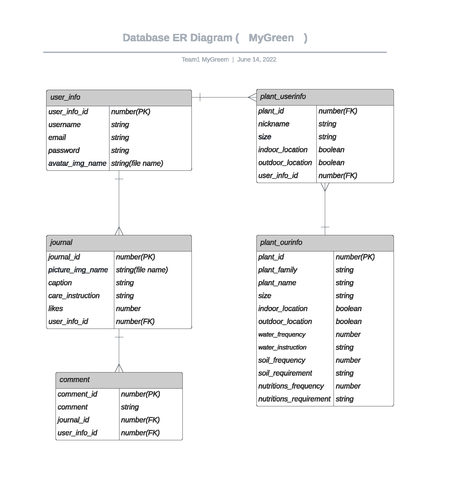

  
   
  Integrated Project - Team Unito
   
   

Visit https://mygreen.netlify.app/login.html

My Green is a web application that helps individuals who have a passion for plants and desire to nurture their plants while sharing their experiences with a community of plant enthusiasts.

## Features
- A weekly plant schedule to keep track of plant care tasks
- Monthly plant suggestions to discover new plants
- Sharing your plant journal with other plant lovers
- Plant identification through pictures

## Tech Stack

- HTML
- SASS
- JavaScript
- Firebase
- Netlify

## Data Model

